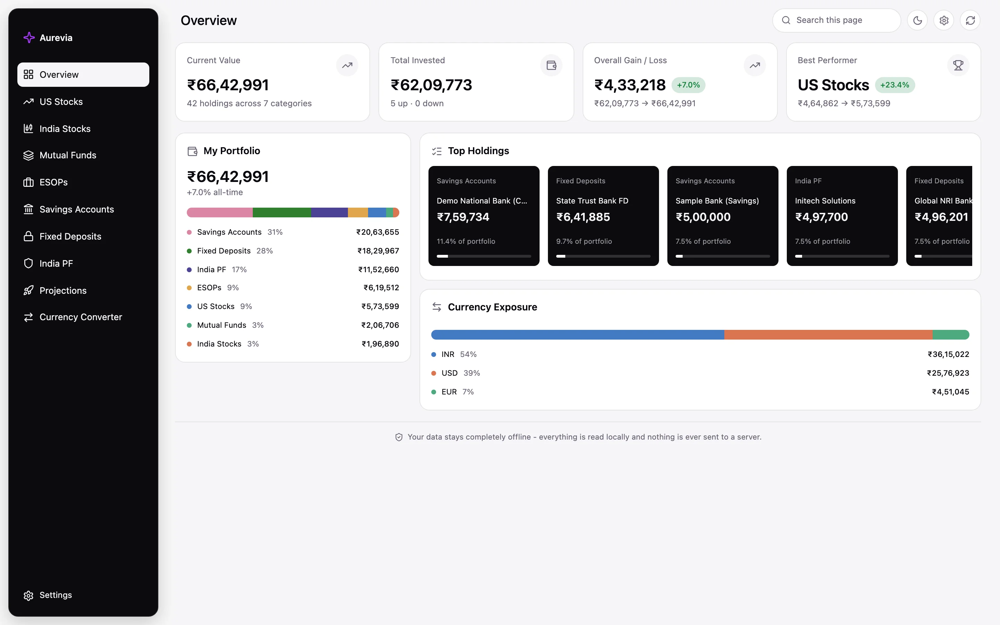
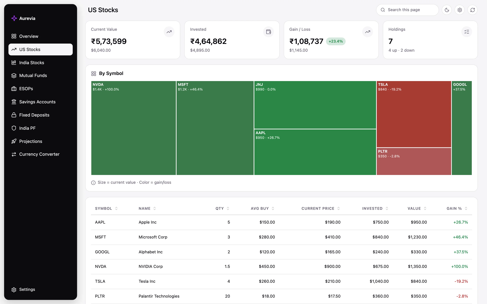
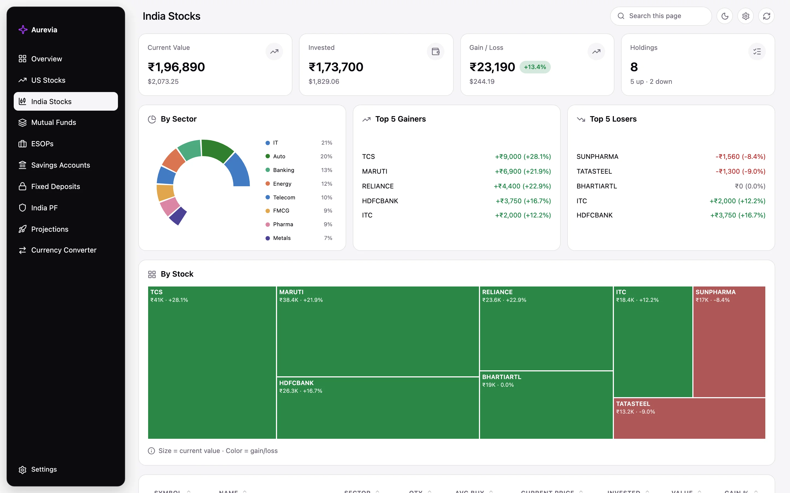
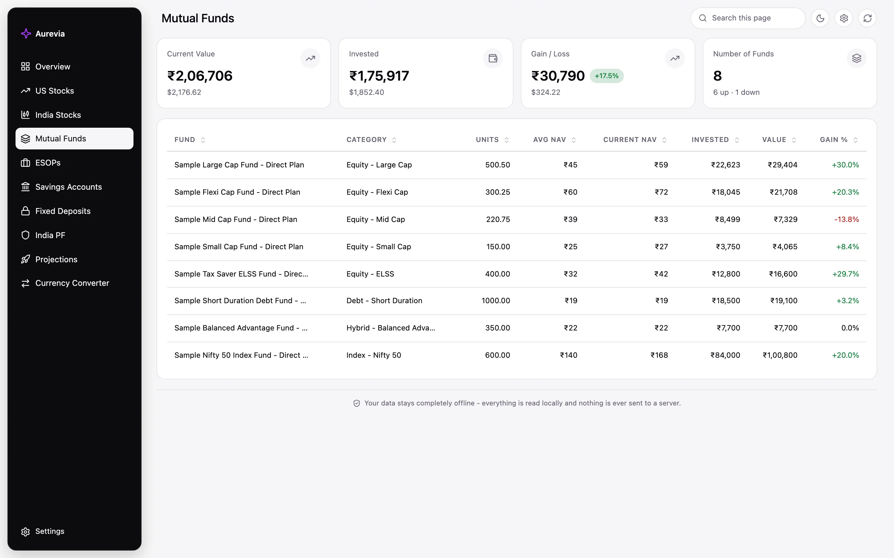
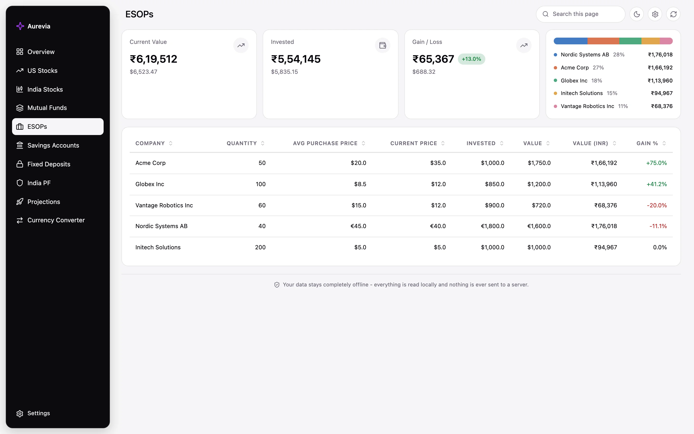
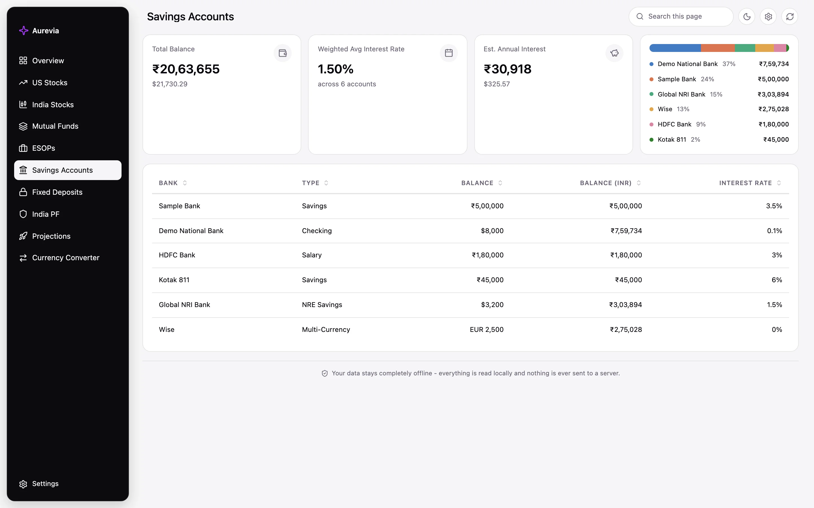
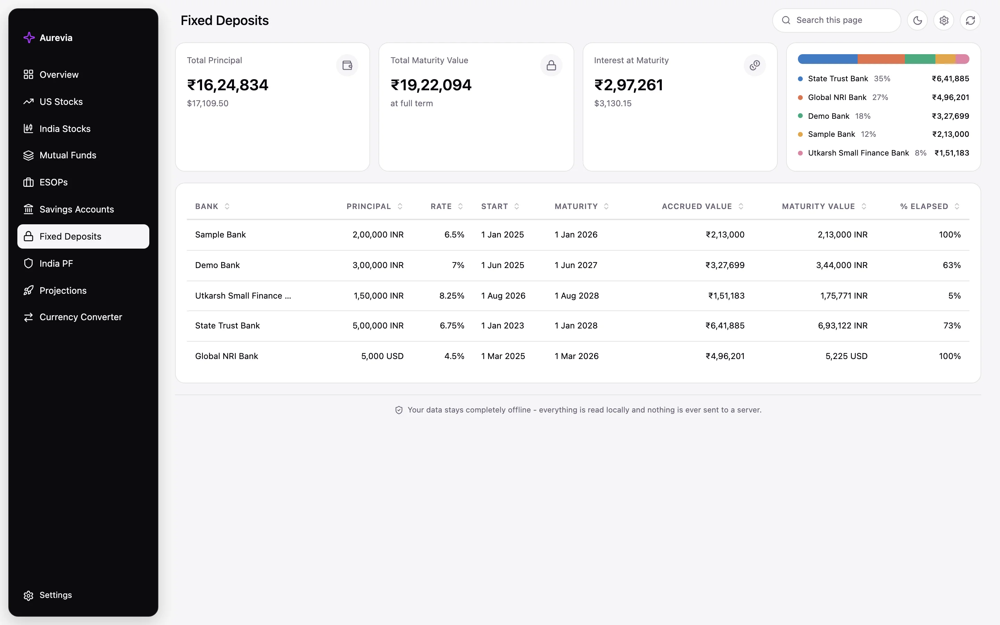
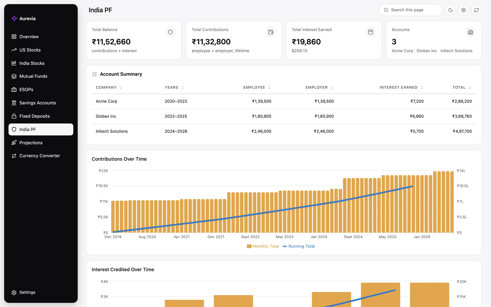
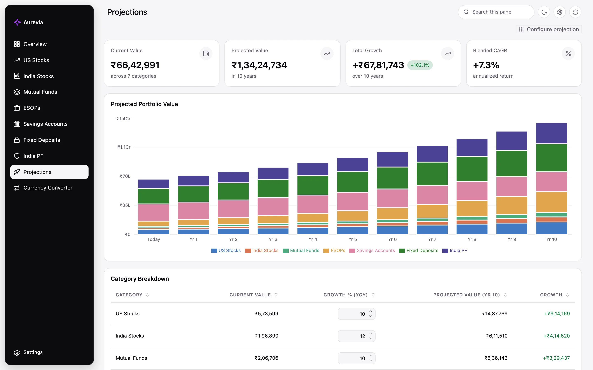
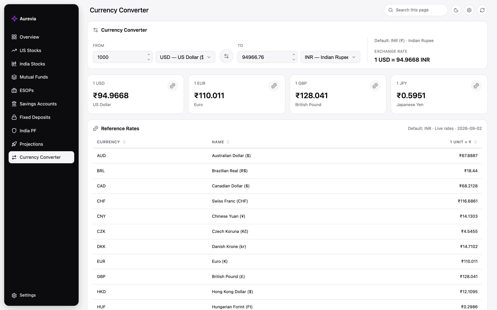

# Aurevia

**[Live demo →](https://akash1269.github.io/Aurevia/)**

A personal net-worth and investment dashboard that runs entirely in your
browser. Point it at plain CSV files — no signup, no backend, no data ever
leaving your machine — and it rolls everything up into one true number: what
you're actually worth, right now, across every account and currency you hold
money in.

## Why Aurevia

Most people's money is scattered: a US brokerage, an Indian demat account,
a couple of mutual funds, ESOPs from an employer, a savings account or two,
a fixed deposit, a Provident Fund statement nobody reads. Getting a single
answer to "what am I worth today, in one currency?" usually means opening
five apps and doing the math by hand.

Aurevia solves that by reading everything from CSV files you control and
converting it all to one display currency, so you can:

- See your **total net worth** and how it's split across asset classes and
  currencies, updated the moment you edit a CSV.
- Track **each account type** — stocks, funds, ESOPs, cash, deposits, PF —
  with the KPIs and holdings detail specific to it, not a generic table.
- Model **where you're headed**, not just where you are, with compounding
  growth projections per asset class.
- Keep everything **private by default** — sample/demo data ships with the
  app so you can try it immediately, and your real numbers stay in local
  CSV files that are never uploaded anywhere.

## Pages

| Page | What it shows |
| --- | --- |
| **Overview** | Total net worth, category breakdown, top holdings across every account, and currency exposure — the one-screen answer to "what am I worth?" |
| **US Stocks** | KPI tiles (value, gain/loss), a sortable holdings table, and an allocation chart for your US equity positions. |
| **India Stocks** | Same as US Stocks, plus sector breakdown for Indian equities. |
| **Mutual Funds** | Units, NAV, and category breakdown for your India mutual fund holdings. |
| **ESOPs** | Employer stock option grants tracked at current vs. average purchase price, in their native currency. |
| **Savings Accounts** | Balances across banks and account types, with interest rate shown per account. |
| **Fixed Deposits** | Principal, tenure, and maturity value per deposit, with weighted average interest rate. |
| **India PF** | A dedicated ledger: account summary by employer, a contribution/interest timeline, and a filterable, searchable transaction history parsed straight from your PF passbook data. |
| **Projections** | Forward-looking compounding projections per asset class over a configurable tenure, with editable growth-rate assumptions per category (defaults to your actual savings/FD interest rates where known). |
| **Currency Converter** | A quick INR/USD (and other currency) converter using the same exchange rates the rest of the dashboard converts with. |
| **Settings** | Switch between sample data and your own; point the app at a local folder of CSVs (via the File System Access API, in supported browsers); set display currency, theme, and which sidebar tabs are visible. |

## Screenshots

All captured from the [live demo](https://akash1269.github.io/Aurevia/) running on its default sample data. Click any screenshot for the full-size image.

<table>
  <tr>
    <td width="50%" align="center">
      <a href=".github/screenshots/overview.webp"></a>
      <br><sub><b>Overview</b></sub>
    </td>
    <td width="50%" align="center">
      <a href=".github/screenshots/us-stocks.webp"></a>
      <br><sub><b>US Stocks</b></sub>
    </td>
  </tr>
  <tr>
    <td align="center">
      <a href=".github/screenshots/india-stocks.webp"></a>
      <br><sub><b>India Stocks</b></sub>
    </td>
    <td align="center">
      <a href=".github/screenshots/mutual-funds.webp"></a>
      <br><sub><b>Mutual Funds</b></sub>
    </td>
  </tr>
  <tr>
    <td align="center">
      <a href=".github/screenshots/esops.webp"></a>
      <br><sub><b>ESOPs</b></sub>
    </td>
    <td align="center">
      <a href=".github/screenshots/savings.webp"></a>
      <br><sub><b>Savings Accounts</b></sub>
    </td>
  </tr>
  <tr>
    <td align="center">
      <a href=".github/screenshots/fixed-deposits.webp"></a>
      <br><sub><b>Fixed Deposits</b></sub>
    </td>
    <td align="center">
      <a href=".github/screenshots/pf.webp"></a>
      <br><sub><b>India PF</b></sub>
    </td>
  </tr>
  <tr>
    <td align="center">
      <a href=".github/screenshots/projections.webp"></a>
      <br><sub><b>Projections</b></sub>
    </td>
    <td align="center">
      <a href=".github/screenshots/currency-converter.webp"></a>
      <br><sub><b>Currency Converter</b></sub>
    </td>
  </tr>
</table>

## How it helps you track your finances

- **One number, every currency.** Every holding — INR, USD, or otherwise —
  is converted to a single display currency using rates you control, so
  "net worth" is actually one number instead of seven.
- **Per-asset detail without losing the big picture.** Drill from the
  Overview into any category for holdings-level detail, then back out to
  see how that category fits into the whole.
- **Goal planning.** Projections let you ask "if I keep contributing at
  this rate, where am I in 10/15/20 years?" per asset class, using either
  realistic defaults or your own assumptions.
- **No account, no server, no risk.** There's no login and nothing to
  breach — the app is a static site, and your financial data lives only in
  CSV files on your own disk (or bundled sample data if you're just
  exploring).
- **Try before you trust it.** Sample data is on by default so you can see
  the whole app working before pointing it at your real numbers.

## Getting started

```bash
npm install
npm run dev
```

Then open the printed local URL (typically `http://localhost:5173`).

Or just use the [hosted version](https://akash1269.github.io/Aurevia/) —
it ships with sample data, and you can switch to your own CSVs from
**Settings** without installing anything.

## Scripts

- `npm run dev` — start the dev server
- `npm run build` — type-check and produce a production build
- `npm run preview` — preview the production build
- `npm run lint` — run eslint

## Using it with your own data

Everything the dashboard displays is sourced from CSV files in
[`public/data/`](public/data). Edit these in place (or replace them) and
reload the page — there's no build step required for data changes in dev.
On the hosted version, use **Settings → Data Source → Choose Folder** to
point the app at a folder of CSVs on your own computer instead (Chrome/Edge
only — this uses the File System Access API, reads live from disk, and
never uploads anything).

| File                     | Category         | Key columns                                                                                    |
| ------------------------ | ---------------- | ---------------------------------------------------------------------------------------------- |
| `us-stocks.csv`          | US Stocks        | `symbol, name, quantity, avg_buy_price_usd, current_price_usd`                                 |
| `india-stocks.csv`       | India Stocks     | `symbol, name, sector, quantity, avg_buy_price_inr, current_price_inr`                         |
| `mutual-funds-india.csv` | Mutual Funds     | `fund_name, category, units, avg_nav, current_nav`                                             |
| `esops.csv`              | ESOPs            | `company, quantity, avg_purchase_price, current_price, currency`                               |
| `savings-accounts.csv`   | Savings Accounts | `bank_name, account_type, balance, interest_rate_pct, currency`                                |
| `fixed-deposits.csv`     | Fixed Deposits   | `bank_name, principal, interest_rate_pct, start_date, maturity_date, maturity_value, currency` |
| `pf.csv`                 | India PF         | `company, month, transaction_date, type, employee, employer, pension, notes`                   |
| `currency-rates.csv`     | Exchange rates   | `currency_code, rate_to_inr` — used to convert every non-INR holding to INR                    |

Notes:

- `pf.csv` is the sole source for India PF — every contribution
  and interest row lives there directly (`type` is either `Contribution` or
  `Interest`), and the per-company Account Summary shown on the PF page and
  used everywhere else in the app (Overview, Top Holdings, Currency
  Exposure) is aggregated from it at read time.
- Add a currency to `currency-rates.csv` before using that currency code
  elsewhere (e.g. in `esops.csv` or `savings-accounts.csv`), or amounts in
  that currency won't convert to INR correctly.
- File paths are resolved through [`public/data/manifest.json`](public/data/manifest.json).
  If you rename or move a CSV, update its entry there.

## Deployment

Pushes to `main` auto-deploy to GitHub Pages via
[`.github/workflows/deploy.yml`](.github/workflows/deploy.yml).

## Tech stack

React 19 + TypeScript, built with Vite, charts via Recharts, CSV parsing
via PapaParse, routing via React Router, icons via Lucide. Styling is
plain CSS Modules — no CSS framework.
